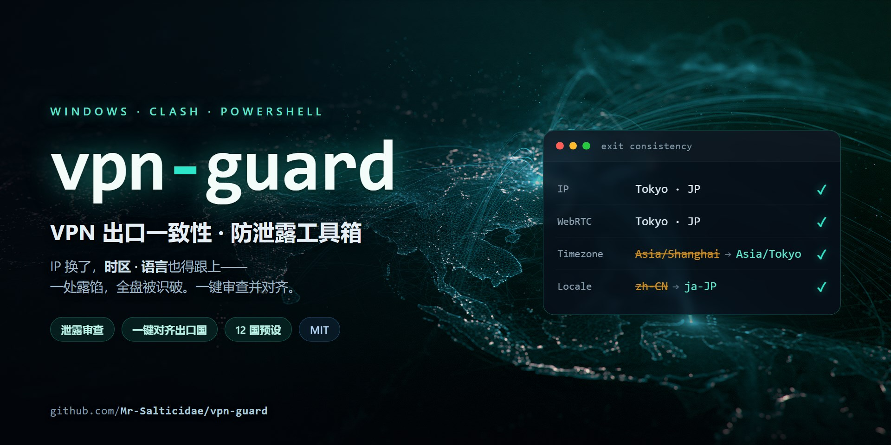

# vpn-guard · VPN 出口一致性 / 防泄露工具箱



> Windows + Clash 用户在使用 VPN 访问**受地区限制的平台**时，用来自查真实身份是否泄露、
> 并让浏览器指纹（时区 / 语言）与出口 IP 所在国**保持一致**的一组 PowerShell 脚本。
>
> A small PowerShell toolkit for Windows + Clash users to **audit VPN leaks** (IP / DNS / WebRTC / IPv6)
> and keep browser fingerprint (timezone / locale) **consistent with the exit-node country**, so
> geo-fingerprinting doesn't flag "this user is on a VPN".

**为什么需要它 / Why**：VPN 换了你的 IP，但浏览器仍按**本机系统时区和语言**上报。当 IP 显示在东京、
浏览器却报 UTC+8 + zh-CN 时，稍讲究的风控系统一眼就能看出你在用代理——IP 对了，指纹却出卖了你。
本工具把"IP / DNS / WebRTC / 时区 / 语言"这几路信号对齐到同一个国家。

> ⚠️ 面向正当用途：访问因地区限制而无法正常打开的学术 / 研究 / 公共资源，以及个人隐私保护。
> 请遵守你所在地和目标平台的法律与服务条款。

---

## 环境要求 / Requirements

- Windows 10/11，Windows PowerShell 5.1（系统自带）
- Google Chrome
- 一个基于 **Clash / Mihomo（TUN 模式 + fake-ip DNS）** 的 VPN 客户端（如 Clash Verge）
- 需要联网调用 `ip-api.com`（免费、免密钥）做出口探测

> 脚本对 Clash 的 fake-ip + TUN 做了针对性判断。其它 VPN 也能用时区/语言对齐功能，
> 但 DNS 一节的判定文案是按 Clash 写的。

## 安装 / Install

```powershell
git clone https://github.com/<you>/vpn-guard.git
cd vpn-guard
```
脚本用**自身所在目录**做工作目录，克隆到任意位置都能直接用，无需改路径。

## 用法 / Usage

### 1. `vpn-leak-audit.ps1` — 一键泄露自查（只读，不改任何系统设置）
```powershell
powershell -ExecutionPolicy Bypass -File .\vpn-leak-audit.ps1
```
检查并以红/黄/绿输出：公网 IP + 地理位置、代理/机房标记、IPv6 泄露面、
**时区一致性**（系统 vs 出口 IP）、语言一致性、DNS 解析路径是否漏到本地 ISP。
换节点或换国家后重跑一次即可。

<details>
<summary>示例输出（示意，非真实数据）</summary>

```
1) 公网出口 IP 与地理位置
  位置      : <City> / <Country> (XX)
  [ OK ] 未被标记为 proxy
  [ OK ] 未被标记为机房 IP
2) IPv6 泄露面        [ OK ] 无公网 IPv6 出口
3) 时区一致性         [FAIL] 系统 UTC+8 vs 出口 UTC+9，差 +1 小时  ← 头号破绽
4) 语言 / locale      [WARN] 浏览器默认语言与出口国不符
5) DNS 解析路径       [ OK ] fake-ip 隧道解析
```
</details>

### 2. `browse-vpn.ps1` — 通用一致性浏览会话（**主力，推荐**）
```powershell
powershell -ExecutionPolicy Bypass -File .\browse-vpn.ps1          # 自动识别当前出口国
powershell -ExecutionPolicy Bypass -File .\browse-vpn.ps1 -DryRun   # 只预览会怎么设置，不切时区/不开浏览器
powershell -ExecutionPolicy Bypass -File .\browse-vpn.ps1 -Country US  # 强制某国（离线兜底 / 固定语言）
```
它会：**探测当前 Clash 节点的出口国** → 临时把系统时区切到与出口匹配的时区、用一个独立 Chrome 配置启动
（语言匹配出口国、关闭浏览器内置 DoH 让 DNS 走隧道）→ **你关闭这个 Chrome 窗口后，系统时区自动还原**。
"系统钟随出口国走"只在浏览会话期间存在。**一个脚本适配所有出口国**，换节点后直接再跑一次，无需改脚本。

> 关键设计：时区**始终跟随真实出口 IP**（而非 `-Country` 参数），避免出现"IP 在东京、时区却设成纽约"的新矛盾。

### 3. 各国快捷入口（双击 / 免记参数）
`browse-jp` 日本 · `browse-us` 美国 · `browse-sg` 新加坡 · `browse-hk` 香港 · `browse-gb` 英国 · `browse-de` 德国 · `browse-kr` 韩国。
每个都等价于 `browse-vpn.ps1 -Country XX`，均支持 `-DryRun`。

**已内置预设**（时区 + 语言）：JP / KR / SG / HK / TW / GB / DE / FR / NL / US / CA / AU。
美 / 加 / 澳等多时区国家按探测到的具体分区（东部 / 中部 / 太平洋…）自动选对时区。
**未预置的国家**会按出口 UTC 偏移自动匹配时区、语言退回 `en-US` 并提示确认。
新增国家只需编辑 `browse-vpn.ps1` 顶部的 `$presets` 表。

## 工作原理 / How it works

| 信号 | 做法 |
|---|---|
| 时区 | `tzutil /s` 临时切系统时区（Windows Chrome **不认 `TZ` 环境变量**，只能改系统时区），会话结束用 `finally` 自动还原 |
| 语言 | Chrome `--lang` / `--accept-lang` + 独立配置的 `intl.selected_languages`，不改系统区域 |
| DNS | 独立 Chrome 配置里关闭"安全 DNS(DoH)"，强制走系统 DNS = Clash fake-ip 隧道，避免浏览器自行解析泄露 |
| IP / WebRTC | 由 Clash TUN 接管，脚本只做审查（`vpn-leak-audit.ps1` 会提示 WebRTC / IPv6 泄露面） |

> 独立 Chrome 配置存放于 `chrome-<国家>-profile/`（已在 `.gitignore` 忽略，不会进仓库）。

## 局限 / Caveats

- 只解决"**技术信号别露馅**"。账号自身的行为特征（登录历史、支付地区、填写地址）不在此列，需你自己保持一致。
- 切换系统时区会让**所有程序**的显示时钟随出口国走；会话期间若有按本地时间触发的定时任务会顺移，属正常。浏览器关闭后自动还原。
- DNS 一节按 Clash（fake-ip + TUN）判定；其它 VPN 请自行确认 DNS 走向。

## 许可 / License

MIT，见 [LICENSE](LICENSE)。
