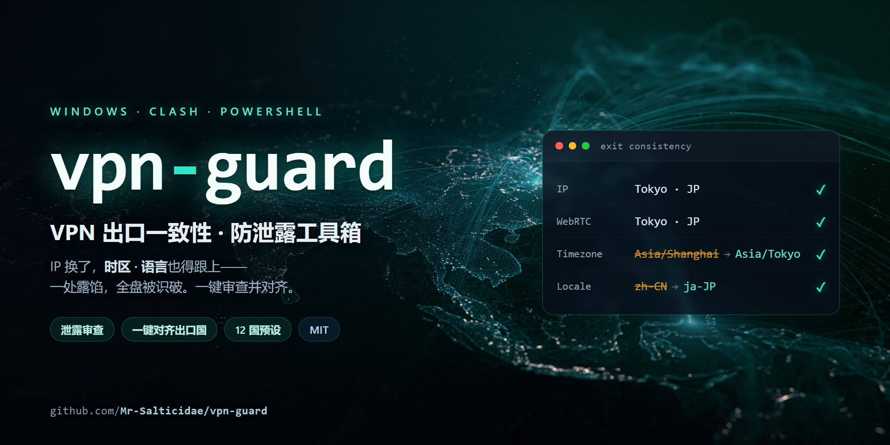

# vpn-guard · VPN 出口一致性 / 防泄露工具箱



[English](README.en.md) | **中文**

[](https://github.com/Mr-Salticidae/vpn-guard/actions/workflows/verify.yml)
[](https://github.com/Mr-Salticidae/vpn-guard/releases)
（每次推送在云端真实 macOS + Linux 上跑：语法 / shellcheck / 泄露自查 / 真 Chrome 遵从 `TZ` /
`app-vpn` 进程级 `TZ` 注入验证）

> **Windows / macOS / Linux** 用户在使用 VPN 访问**受地区限制的平台**时，用来自查真实身份是否泄露、
> 并让浏览器指纹（时区 / 语言）与出口 IP 所在国**保持一致**的一组脚本。
> Windows 用 PowerShell 版（`.ps1`），macOS / Linux 用 Bash 版（`.sh`），功能对等。
> 覆盖主流代理客户端：**Clash / Mihomo、V2Ray / Xray（v2rayN）、sing-box、Shadowsocks、
> Hysteria、WireGuard、OpenVPN**——按"流量接管方式"自动适配，不绑定具体客户端。

**为什么需要它 / Why**：VPN 换了你的 IP，但浏览器仍按**本机系统时区和语言**上报。当 IP 显示在东京、
浏览器却报 UTC+8 + zh-CN 时，稍讲究的风控系统一眼就能看出你在用代理——IP 对了，指纹却出卖了你。
本工具把"IP / DNS / WebRTC / 时区 / 语言"这几路信号对齐到同一个国家。

> ⚠️ 面向正当用途：访问因地区限制而无法正常打开的学术 / 研究 / 公共资源，以及个人隐私保护。
> 请遵守你所在地和目标平台的法律与服务条款。

---

## 作用范围 / Scope —— 浏览器？桌面应用？CLI？

常见误解是"这套工具只管浏览器"。实际分工如下：

| | 浏览器（Chrome） | 桌面应用（Claude / ChatGPT / Cursor 等 Electron） | CLI（Codex CLI / Claude Code / git / curl） |
|---|---|---|---|
| `vpn-leak-audit` 自查 | ✅ 全部 8 项 | ✅ 除第 7 项 WebRTC 外全部适用 | ✅ 除第 7 项 WebRTC 外全部适用 |
| `browse-vpn` 一致性会话 | ✅ 就是为它做的 | ❌ 管不到 | ❌ 管不到 |
| `app-vpn` 一致性会话 | —（用 browse-vpn） | ✅ 代理 / 语言；时区见下表 | ✅ 代理 / 时区 / 语言全部生效 |

**桌面应用有一条浏览器没有的泄露路径**，这也是 `app-vpn` 存在的理由：

> 浏览器和 .NET 程序会自动读系统代理设置；但 **Node / Rust / Go 写的 CLI（Codex CLI、Claude Code CLI）
> 与 Electron 的 Node 主进程不读**，它们只认 `HTTP_PROXY` / `HTTPS_PROXY` 环境变量。
> 于是在**只开系统代理、没开 TUN** 的机器上：浏览器安全，而这些程序在直连暴露你的真实 IP。
> 自查的**第 2 项**就是专门实测这条路径的（用 `curl --noproxy '*'` 复刻"完全不认代理的程序"再与浏览器出口比对）。

**时区能不能进程级隔离，取决于运行时而非平台**（下表结论均为实测）：

| 目标程序 | Windows 认 `TZ` 吗 | 做法 |
|---|---|---|
| Node / Rust / Go 等 CLI | ✅ 认 | `app-vpn.ps1` 直接注入 `TZ`，**不碰系统时钟** |
| Chromium / Electron GUI | ❌ 不认 | 需 `app-vpn.ps1 -SystemTz` 临时切系统时区，退出自动还原 |
| macOS / Linux 上的**任何**程序 | ✅ 认（Chromium 也认） | 一律进程级注入 `TZ`，系统时区从头到尾不动 |

> 一句话：**想一劳永逸兜住所有程序，就开客户端的 TUN 模式**；`app-vpn` 是没有 TUN
> （或想让单个程序的时区/语言也对齐）时的按应用方案。

---

## 环境要求 / Requirements

| | Windows | macOS / Linux |
|---|---|---|
| 脚本运行时 | Windows PowerShell 5.1（Win10/11 自带） | bash 3.2+ / curl（系统自带） |
| 浏览器 | Google Chrome | Google Chrome 或 Chromium |
| 代理/VPN | Clash / Mihomo、V2Ray / Xray（v2rayN 等）、sing-box、Shadowsocks、Hysteria、WireGuard、OpenVPN…… | 同左 |
| 网络 | 需联网调用 `ip-api.com`（免费、免密钥）做出口探测 | 同左 |

> 按**流量接管方式**自动适配，与具体客户端品牌解耦：
>
> | 接管方式 | 典型场景 | 工具行为 |
> |---|---|---|
> | **TUN / 虚拟网卡** | Clash Verge TUN、sing-box tun、WireGuard、OpenVPN | 全局接管（含 UDP/WebRTC），自查判 OK |
> | **系统代理 / PAC** | v2rayN 默认、Clash 系统代理 | 浏览器没问题，但会提示"不认代理的应用与 UDP/WebRTC 可能绕行直连" |
> | **仅本地端口** | v2ray 只开 SOCKS/HTTP 入站 | 自查大声警告；浏览会话用 `--proxy` 参数让 Chrome 直接走该端口 |

## 安装 / Install

```bash
git clone https://github.com/<you>/vpn-guard.git
cd vpn-guard
chmod +x *.sh        # 仅 macOS / Linux 需要（git 通常已保留可执行位）
```
脚本用**自身所在目录**做工作目录，克隆到任意位置都能直接用，无需改路径。

## 用法 / Usage

### 1. 一键泄露自查（只读，不改任何系统设置）

```powershell
# Windows
powershell -ExecutionPolicy Bypass -File .\vpn-leak-audit.ps1
powershell -ExecutionPolicy Bypass -File .\vpn-leak-audit.ps1 -NoDnsLeak    # 跳过 DNS 联网实测
powershell -ExecutionPolicy Bypass -File .\vpn-leak-audit.ps1 -NoSpeedTest  # 跳过链路质量实测
```
```bash
# macOS / Linux
./vpn-leak-audit.sh
./vpn-leak-audit.sh --no-dns-leak     # 跳过 DNS 联网实测
./vpn-leak-audit.sh --no-speed-test   # 跳过链路质量实测
```
检查并以红/黄/绿输出：**代理客户端与流量接管方式**（TUN / 系统代理 / 都没有）、
公网 IP + 地理位置、代理/机房标记、**桌面应用 / CLI 出口一致性**、IPv6 泄露面、
**时区一致性**（系统 vs 出口 IP）、语言一致性、DNS 解析路径（静态配置 + **DNS 泄露主动实测**）、
**WebRTC 主动检测入口**、**链路质量**（握手 + 吞吐，够不够看视频）。换节点或换国家后重跑一次即可。

> **桌面应用 / CLI 出口实测**（第 2 项）：用 `curl --noproxy '*'` 复刻"完全不认代理的程序"发起请求，
> 再与第 1 项的浏览器出口比对。**两者不一致就说明 Claude / Codex 这类程序正在绕过代理直连**。
> 这是被动检查看不出来的：注册表里系统代理开着、浏览器一切正常，而 Node/Electron 主进程根本不读它。
> 判定为泄露时会同时提示两条修复路径（开 TUN / 用 `app-vpn`）。

> **链路质量实测**（默认开启）：前 7 项回答"我安不安全"，第 8 项回答"我这条链路够不够用"。
> 实测走代理的 TLS 握手耗时与实际吞吐，直接给出"够不够看 720p / 1080p"的判定。
> **别用 ping 判断快慢**——fake-ip 下所有域名都解析到 `198.18.x.x`、ICMP 由本机应答，
> 节点挂了 ping 也照样秒通；客户端面板的延迟数字同样不反映带宽（只测一次握手往返），
> 低延迟节点完全可能是低带宽节点。约 20MB 流量，加 `--no-speed-test` / `-NoSpeedTest` 可跳过。

> **DNS 泄露主动实测**（默认开启）：对随机子域发起真实解析，回查是哪些解析器实际应答（含归属国 / ASN），
> 再与出口国对比——能抓到"配置看着走隧道、实际却漏给本地 ISP"这类被动检查看不出的泄露。
> 走 [bash.ws](https://bash.ws)（dnsleaktest.com 官方 CLI 同源）的免费 API，只发随机子域、不含任何个人数据；
> 加 `--no-dns-leak` / `-NoDnsLeak` 可跳过联网实测。

<details>
<summary>示例输出（示意，非真实数据）</summary>

```
0) 代理客户端与流量接管方式
  客户端进程 : verge-mihomo
  [ OK ] TUN 模式 —— 全局流量（含 UDP/WebRTC）均被接管
1) 公网出口 IP 与地理位置
  位置      : <City> / <Country> (XX)
  [ OK ] 未被标记为 proxy
  [ OK ] 未被标记为机房 IP
2) 桌面应用 / CLI 出口
  代理环境变量 : 未设置 —— 这类程序不会主动走代理，只能靠 TUN 兜底
  [FAIL] 不认代理的程序直连出口 <真实IP>（China / <你的ISP>），
         与浏览器出口 <出口IP>（Japan）不一致 —— 真实 IP 正在泄露！
         受影响：Codex CLI、Claude Code CLI、Claude/ChatGPT 桌面版的 Node 主进程……
3) IPv6 泄露面        [ OK ] 公网 IPv6 归属与出口国一致（走隧道，未泄露）
4) 时区一致性         [FAIL] 系统 UTC+8 vs 出口 UTC+9，差 +1 小时  ← 头号破绽
5) 语言 / locale      [WARN] 浏览器默认语言与出口国不符
6) DNS 解析路径       [ OK ] fake-ip 隧道解析（静态配置）
   DNS 泄露主动实测   [FAIL] 解析器在 China，出口却在 Japan —— DNS 正泄露给本地 ISP
7) WebRTC 泄露面      [ OK ] 检测页已就绪，实测：browse-vpn --webrtc
8) 链路质量           [ OK ] TLS 握手 0.27s —— 节点响应快
                      [ OK ] 下行 167.8 Mbps —— 1080p 流畅
```
</details>

### 2. 通用一致性浏览会话（**主力，推荐**）

```powershell
# Windows
powershell -ExecutionPolicy Bypass -File .\browse-vpn.ps1           # 自动识别当前出口国
powershell -ExecutionPolicy Bypass -File .\browse-vpn.ps1 -DryRun   # 只预览，不切时区/不开浏览器
powershell -ExecutionPolicy Bypass -File .\browse-vpn.ps1 -Country US  # 强制某国（离线兜底 / 固定语言）
powershell -ExecutionPolicy Bypass -File .\browse-vpn.ps1 -Proxy http://127.0.0.1:10809
    # 客户端只开本地端口（未开系统代理/TUN）时，让 Chrome 直接走该端口（v2rayN 默认 HTTP 10809）
powershell -ExecutionPolicy Bypass -File .\browse-vpn.ps1 -WebRTC   # 附带打开 WebRTC 泄露主动检测页
```
```bash
# macOS / Linux
./browse-vpn.sh              # 自动识别当前出口国
./browse-vpn.sh --dry-run    # 只预览，不开浏览器
./browse-vpn.sh US           # 强制某国（离线兜底 / 固定语言）
./browse-vpn.sh --proxy=socks5://127.0.0.1:1080   # 仅本地端口场景：探测和 Chrome 都走它
./browse-vpn.sh --webrtc     # 附带打开 WebRTC 泄露主动检测页
```

> 脚本启动前会自查流量接管方式：既没有 TUN / 系统代理、又没给 `--proxy` 时会**红字警告**
> ——那种情况下 Chrome 会直连暴露真实 IP。v2ray 系用户没开系统代理时请带上 `--proxy`。
> （Windows PS5.1 的出口探测只支持 `http://` 代理，v2rayN 用户建议填 10809 的 HTTP 端口；
> macOS/Linux 的 curl 原生支持 `socks5://`。）

它会：**探测当前 VPN 节点的出口国** → 让浏览器时区与出口匹配、用一个独立 Chrome 配置启动
（语言匹配出口国、关闭浏览器内置 DoH 让 DNS 走隧道）。**一个脚本适配所有出口国**，
换节点后直接再跑一次，无需改脚本。

平台差异（这是 Unix 版更省心的地方）：

- **Windows**：Chrome 不认 `TZ` 环境变量，只能用 `tzutil` **临时切系统时区**，
  你关闭该 Chrome 窗口后自动还原（`finally` 保证）。会话期间系统钟随出口国走，属正常。
- **macOS / Linux**：Chrome 认 `TZ` 环境变量，脚本用 `TZ=<出口IANA时区>` 启动 Chrome，
  **只影响这一个浏览器进程，系统时区从头到尾不被改动**，也就不存在还原问题。

> 关键设计：时区**始终跟随真实出口 IP**（而非国家参数），避免出现"IP 在东京、时区却设成纽约"的新矛盾。

### 3. `app-vpn` — 桌面应用 / CLI 的一致性会话（**Claude、Codex 等用这个**）

`browse-vpn` 只作用于它启动的那个 Chrome。**Claude 桌面版 / Codex CLI / Claude Code / Cursor
完全不在它的射程内**——这个脚本就是给它们准备的。

```powershell
# Windows
powershell -ExecutionPolicy Bypass -File .\app-vpn.ps1 -List      # 列出可识别的应用别名
powershell -ExecutionPolicy Bypass -File .\app-vpn.ps1 codex      # 在一致性环境里跑 Codex CLI
powershell -ExecutionPolicy Bypass -File .\app-vpn.ps1 claude     # Claude Code CLI
powershell -ExecutionPolicy Bypass -File .\app-vpn.ps1 claude-desktop -SystemTz
    # Claude 桌面版（Electron）：加 -SystemTz 时区才会跟着变，关闭后自动还原
powershell -ExecutionPolicy Bypass -File .\app-vpn.ps1 "D:\any\app.exe"   # 任意可执行文件
powershell -ExecutionPolicy Bypass -File .\app-vpn.ps1 -Print     # 只打印环境变量，自己贴到别的终端
powershell -ExecutionPolicy Bypass -File .\app-vpn.ps1 codex -DryRun
```
```bash
# macOS / Linux
./app-vpn.sh --list
./app-vpn.sh codex
./app-vpn.sh claude-desktop          # Unix 上 Chromium 也认 TZ，GUI 无需任何额外开关
./app-vpn.sh --print
./app-vpn.sh codex --dry-run
./app-vpn.sh codex -- --model o3     # -- 之后的参数原样透传给目标程序
```

它会：**探测当前出口国** → 给目标程序**进程级**注入
`HTTPS_PROXY` / `HTTP_PROXY` / `ALL_PROXY`（大小写两套都设，因为各语言生态读法不一）、
`NO_PROXY=localhost,127.0.0.1,::1,*.local`（本地 MCP server / 开发服务不该被代理）、
`TZ`、`LANG` / `LC_ALL` → 启动它 → 退出后还原。

**内置别名**：`codex` · `claude`（Claude Code CLI）· `claude-desktop` · `cursor` · `code` · `chatgpt`，
也可直接传任意路径或 PATH 里的命令名。Windows 上找不到硬编码路径时会去注册表卸载项里查真实安装位置
（装到非 C 盘也能找到）。

> **给目标程序传参数**：直接写在后面即可，本脚本不认识的参数会原样透传
> （`app-vpn.ps1 node -e "..."`、`./app-vpn.sh codex resume --last`）。
> 例外是 Windows 上目标程序的短选项恰好是本脚本参数名的唯一前缀（`-c` → `-Country`、
> `-s` → `-SystemTz`、`-d` → `-DryRun`、`-l` → `-List`），会被 PowerShell 抢走；
> 这时把整条命令交给 `-Run`：`app-vpn.ps1 -Run "codex -c model=gpt-5 -s workspace-write"`。
> （PowerShell 的 `-File` 模式不支持 `--` 分隔符，所以 Windows 用 `-Run`，Unix 直接用 `--`。）

> **不改任何系统设置**：环境变量只注入被启动的那个进程，脚本自身退出前还原，
> 从不写入用户级/系统级环境变量。唯一的例外是 Windows 上显式加了 `-SystemTz`——
> 那会临时切系统时区（Chromium 不认 `TZ`，别无他法），退出时 `finally` 保证还原。

### 4. `webrtc-leak-test.html` — WebRTC 泄露主动检测

WebRTC 会为了打洞通过 STUN 发 UDP，拿回"公网看到的你的 IP"。**若这条 UDP 没走 VPN 隧道，
它会暴露你的真实 IP**——哪怕网页用 HTTP 看到的是出口 IP。系统代理模式挡不住它，TUN 模式才行。
这是浏览器 API，命令行审计覆盖不到，所以单独做了一个主动检测页：

- **推荐**：`browse-vpn.ps1 -WebRTC` / `./browse-vpn.sh --webrtc` —— 在一致性会话（真实隧道）里打开检测页，最贴近实战。
- 或直接双击 `webrtc-leak-test.html`，用任意浏览器打开。

页面会自动发起真实 STUN 探测，对比 WebRTC 反射候选（srflx）与出口 IP，给出判定：
**一致**（安全）/ **泄露**（暴露了与出口不同的公网 IP，红字标出）/ **无 srflx**（UDP 已被隧道，无泄露面）。
纯前端、无外部依赖（仅连公共 STUN），不上传任何数据。

> 修复泄露：用浏览器扩展禁用 WebRTC，或让客户端以 **TUN 模式**接管全局 UDP。

### 5. 各国快捷入口（Windows，双击 / 免记参数）
`browse-jp` 日本 · `browse-us` 美国 · `browse-sg` 新加坡 · `browse-hk` 香港 · `browse-gb` 英国 · `browse-de` 德国 · `browse-kr` 韩国。
每个都等价于 `browse-vpn.ps1 -Country XX`，均支持 `-DryRun`。
macOS / Linux 直接传国家码即可（`./browse-vpn.sh jp`），无需单独入口脚本。

**已内置预设**（时区 + 语言）：JP / KR / SG / HK / TW / GB / DE / FR / NL / US / CA / AU。
美 / 加 / 澳等多时区国家按探测到的具体分区（东部 / 中部 / 太平洋…）自动选对时区。
**未预置的国家**：探测成功时时区直接用出口 IANA 时区（Unix 天然支持；Windows 按映射表/UTC 偏移匹配），
语言退回 `en-US` 并提示确认。新增国家只需编辑 `browse-vpn.ps1` 顶部 `$presets` /
`browse-vpn.sh` 里的 `preset()` 函数。

## 工作原理 / How it works

| 信号 | Windows | macOS / Linux |
|---|---|---|
| 时区（浏览器） | `tzutil /s` 临时切系统时区（Chrome 不认 `TZ`），会话结束 `finally` 自动还原 | `TZ=<IANA时区>` 启动 Chrome，仅该进程生效，不碰系统时区 |
| 时区（桌面/CLI） | Node/Rust/Go 类程序**认 `TZ`**，`app-vpn` 直接进程级注入；Electron GUI 不认，需显式 `-SystemTz` 临时切系统时区 | 一律进程级注入 `TZ`（Chromium 在 Unix 上也认），系统时区从头到尾不动 |
| 代理（桌面/CLI） | `app-vpn` 注入 `HTTP(S)_PROXY` / `ALL_PROXY` / `NO_PROXY`（大小写各一套），地址取自 `-Proxy` 或系统代理注册表 | 同左，地址取自 `--proxy` 或 macOS `scutil --proxy` / Linux 现有环境变量 |
| 桌面应用泄露实测 | `curl --noproxy '*'` 复刻"完全不认代理的程序"取出口，与浏览器侧（走系统代理的 .NET）出口比对，不一致即判泄露 | 同左（macOS/Linux 的 curl 同样不读系统代理设置，逻辑一致） |
| 语言 | Chrome `--lang` / `--accept-lang` + 独立配置的 `intl.selected_languages`，不改系统区域；桌面/CLI 由 `app-vpn` 注入 `LANG` / `LC_ALL` | 同左 |
| DNS（静态） | 独立 Chrome 配置里关闭"安全 DNS(DoH)"，强制走系统 DNS（TUN 模式=fake-ip 隧道；系统代理模式下域名由代理远端解析），避免浏览器自行解析泄露 | 同左 |
| DNS（主动实测） | 对随机子域发起真实连接触发递归解析，用 bash.ws 回查实际应答的解析器归属国/ASN，与出口国比对判定泄露 | 同左（curl 触发，逻辑一致） |
| IP | 由 TUN / 系统代理 / `--proxy` 接管，脚本审查接管方式 | 同左 |
| IPv6 | 取公网 IPv6 后查其归属并**与出口国比对**：一致=也走隧道（未泄露）；不一致=绕过 VPN 暴露真实 ISP（真泄露）。避免"有 IPv6 就报警"的误报 | 同左 |
| WebRTC | `webrtc-leak-test.html` 主动检测：真实 STUN 探测，对比 srflx 与出口 IP 判定是否泄露；`browse-vpn --webrtc` 在真实隧道内跑 | 同左（纯前端，跨平台一致） |
| 链路质量 | 走当前接管路径（TUN 直连隧道 / 系统代理加 `-x`）向 Cloudflare 测速点取 20MB，读 `time_appconnect` 与 `speed_download`，按 480p/720p/1080p 档位判定 | 同左（macOS 系统代理从 `scutil --proxy` 取地址；PAC 模式跳过以免失真） |

> 独立 Chrome 配置存放于 `chrome-<国家>-profile/`（已在 `.gitignore` 忽略，不会进仓库），
> 两个平台的脚本共用同一套目录命名。

## 局限 / Caveats

- 只解决"**技术信号别露馅**"。账号自身的行为特征（登录历史、支付地区、填写地址）不在此列，需你自己保持一致。
- **仅 Windows**：切换系统时区会让**所有程序**的显示时钟随出口国走；会话期间若有按本地时间触发的定时任务会顺移，属正常，浏览器关闭后自动还原。macOS / Linux 版不改系统时区，无此影响。（`app-vpn.ps1` 只在你显式加 `-SystemTz` 时才会切系统时区，CLI 场景默认不切。）
- **`app-vpn` 靠环境变量约定生效，不是强制拦截**：它注入 `HTTPS_PROXY` 等变量，前提是目标程序愿意读。绝大多数 Node / Rust / Go / Python 生态的工具都读，但**硬编码直连、或自带网络栈完全忽略这些变量的程序它管不住**。要对任意程序都强制生效，只有 TUN 模式（内核层接管）。自查第 2 项测的正是"完全不读代理设置的程序"这一最坏情况——它报绿，才说明 TUN 真的兜住了。
- **Electron 应用的时区是半覆盖的**：`app-vpn` 注入的 `TZ` 在 Windows 上只对 Node 主进程生效，Chromium 渲染层（也就是应用里显示的网页内容）仍读系统时区，必须加 `-SystemTz` 才一致。macOS / Linux 无此问题。
- **`-Print` 模式打印的环境变量含代理地址**，贴到公开场合前请自行判断（通常是 `127.0.0.1:<端口>`，不含凭据）。
- macOS / Linux 版依赖本机 tzdata 时区数据库解析 IANA 时区名（主流系统均自带；极简容器环境需先装 `tzdata`，脚本检测不到时会提示）。
- 泄露自查按"接管方式"判定（TUN / 系统代理 / 仅本地端口），主流客户端（Clash/Mihomo、V2Ray/Xray、sing-box、SS、WireGuard、OpenVPN）均适用；`198.18.x` fake-ip 特征判定覆盖 Clash/Mihomo/sing-box/Xray fakedns。
- 系统代理模式下浏览器是安全的，但 UDP/WebRTC 与不认代理的应用可能绕行——想全局兜住请开客户端的 TUN 模式。
- DNS 泄露主动实测依赖第三方服务 [bash.ws](https://bash.ws)（与 ip-api / ipify 同为默认联网项）：只发随机子域探测、不上传个人数据，服务只看到你的解析器 IP（这正是检测目标）。介意联网可加 `--no-dns-leak`。fake-ip 环境下若仍报解析器在本地，多因客户端 DNS 用了域内上游——按提示让 DNS 走隧道远端解析即可。
- **链路质量只是一次快检，不是测速软件**：单次 20MB / 8 秒采样，够区分「能不能看 720p / 1080p」这几档，但对高速链路（>100 Mbps）区分度不足，同一节点多次测量会有波动。要在多个节点间**排序**请用专门的测速工具，别拿这个数字做精细比较。它依赖 Cloudflare 测速点（`speed.cloudflare.com`），不可达时会优雅跳过并提示——那本身也是节点不稳的信号。
- **ping 通 ≠ 链路可用**：fake-ip 模式下所有域名都解析到 `198.18.x.x`、ICMP 由本机应答，无论节点好坏 ping 都秒通、延迟接近 0，`ping` / `tracert` / `nslookup` 在这里全部失去诊断意义。同理，客户端面板的「延迟测试」只测一次握手往返，**不反映带宽**——实测中出现过延迟排名中上游的节点带宽垫底（2.72 Mbps，连 480p 都紧张）。判断快慢请看第 7 项的握手耗时与吞吐。

## 许可 / License

MIT，见 [LICENSE](LICENSE)。
